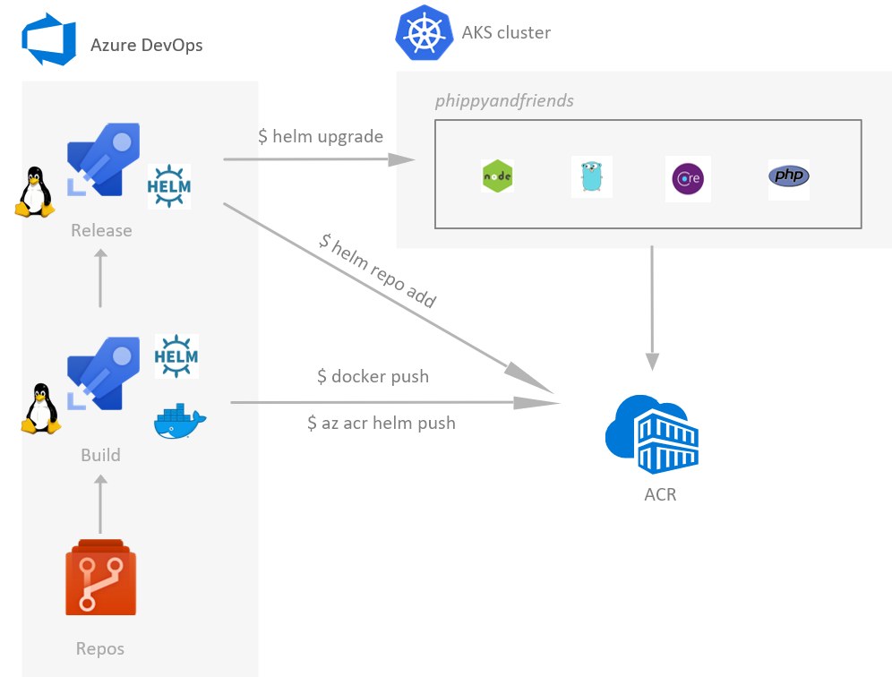
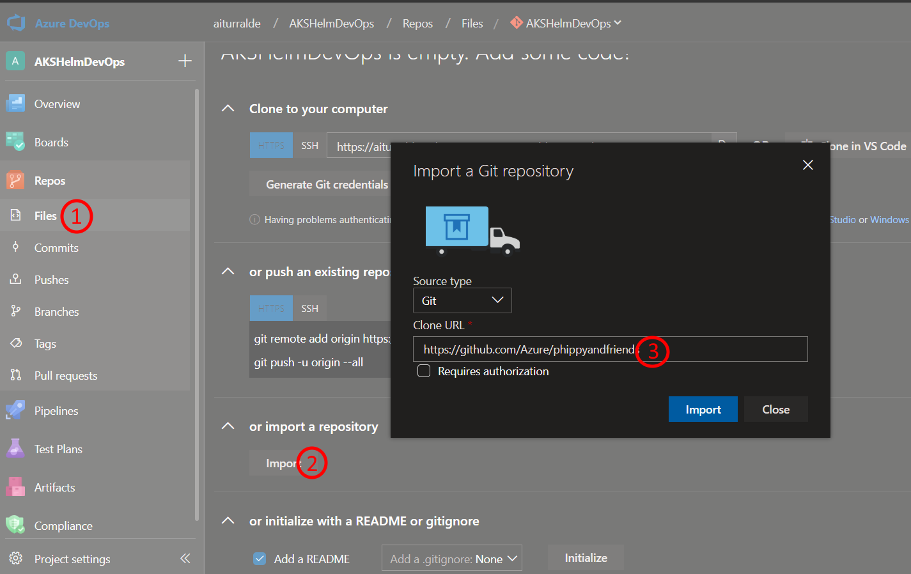
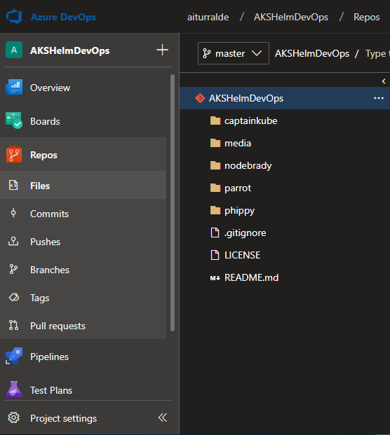
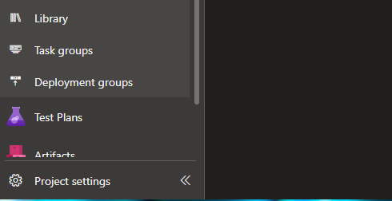
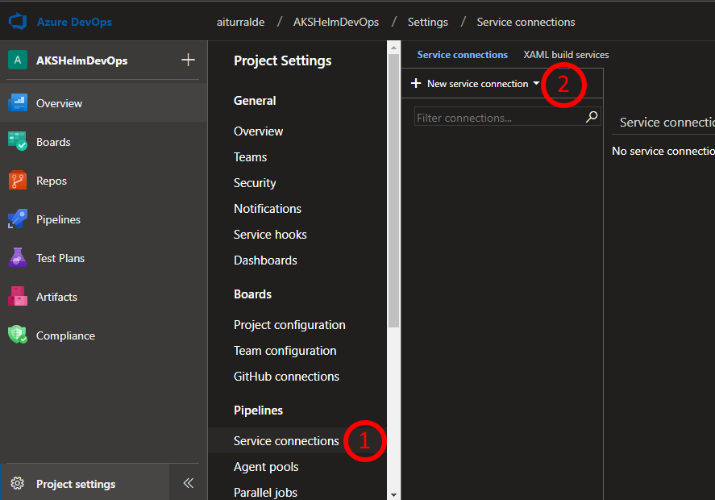
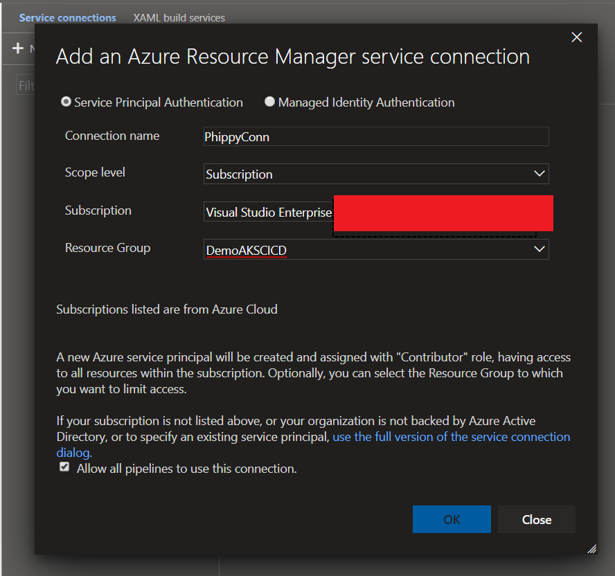
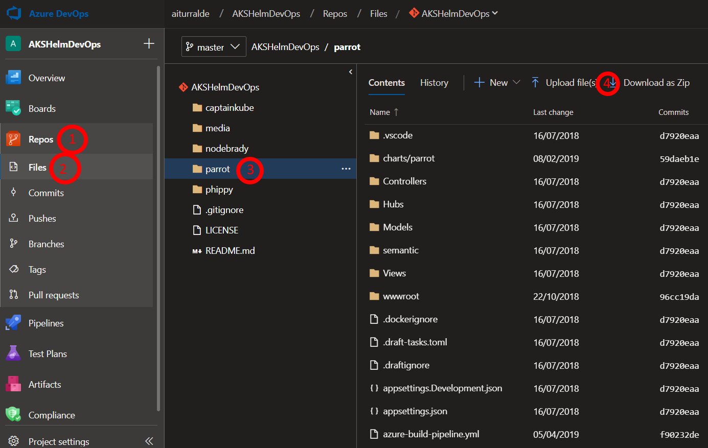
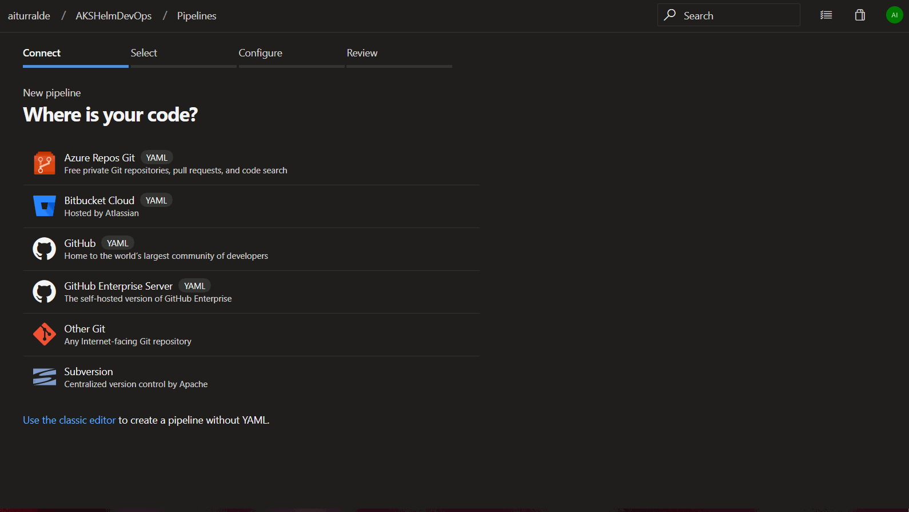
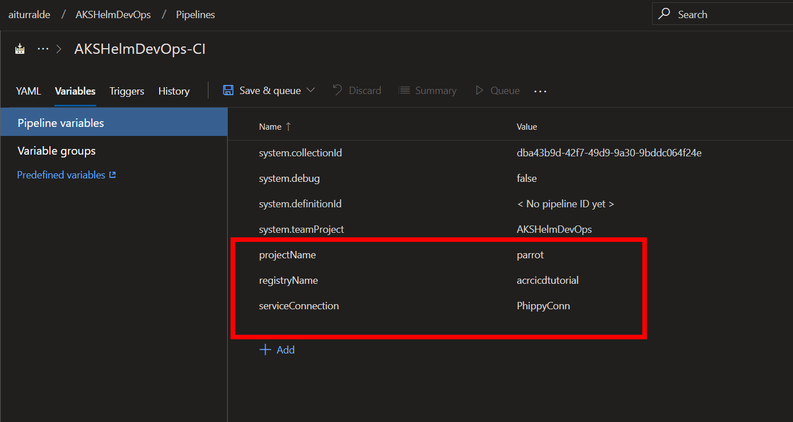
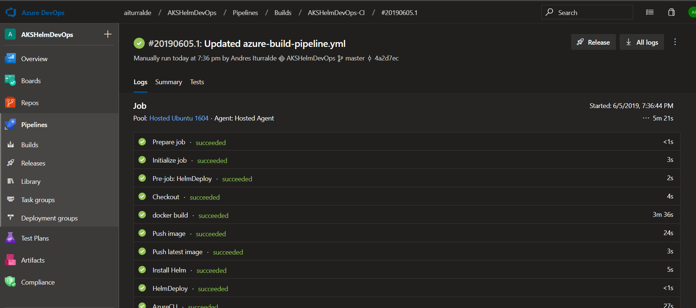

Tabla de Contenidos
- [Introducción](#introducci%C3%B3n)
  - [Prerrequisitos](#prerrequisitos)
  - [Conocimientos básicos de Kubernetes](#conocimientos-b%C3%A1sicos-de-kubernetes)
  - [Vistazo general de la aplicación](#vistazo-general-de-la-aplicaci%C3%B3n)
- [Ejercicio 1: Creando un servicio de Azure Kubernetes Services y Azure Container Registry](#ejercicio-1-creando-un-servicio-de-azure-kubernetes-services-y-azure-container-registry)
  - [Creación de un Container Registry](#creaci%C3%B3n-de-un-container-registry)
  - [Creación de un Azure Kubernetes Services](#creaci%C3%B3n-de-un-azure-kubernetes-services)
- [Ejercicio 2: Importando el código](#ejercicio-2-importando-el-c%C3%B3digo)
- [Ejercicio 3: Creando el Build Pipeline](#ejercicio-3-creando-el-build-pipeline)

# Introducción

 
En este laboratorio se realizará las tareas necesarias para efectuar un deployment de una aplicación de contenedores en Kubernetes en un ambiente de Azure Kubernetes Services (AKS). 

Alguna de las cosas que se verán en este laboratorio serán:

- Deployment de Kubernetes
- Deploy de una aplicaciíon mediante Helm
- Construyendo un pipeline de CI/CD utilizando Azure DevOps y Azure Container Registry

> Este laboratorio se basa en las instrucciones indicadas en el artículo [https://cloudblogs.microsoft.com/opensource/2018/11/27/tutorial-azure-devops-setup-cicd-pipeline-kubernetes-docker-helm/](https://cloudblogs.microsoft.com/opensource/2018/11/27/tutorial-azure-devops-setup-cicd-pipeline-kubernetes-docker-helm/). Sin embargo, introduce mejoras al proceso señalado en dicho artículo.

## Prerrequisitos
- Subscripción de Azure. Sí no posee una, obtenga un trial: [https://azure.microsoft.com/es-es/free/](https://azure.microsoft.com/es-es/free/)
- Cuenta de Azure DevOps, puede obtener una en [https://dev.azure.com](https://dev.azure.com)
- Para la ejecución de comandos puede utilizar el Azure Cloud Shell disponible en [https://shell.azure.com/](https://shell.azure.com/) una vez que inicie sesión con su subscripción de Azure. El Azure Cloud Shell tiene pre-instalado y configurado el Azure CLI para conectarse a su subscripción ded Azure así como tambien **kubectl** y **helm**.

## Conocimientos básicos de Kubernetes
Para este laboratorio se asume que se tiene conocimientos básicos sobre Kubernetes y sus conceptos generales.

Si es nuevo en Kubernetes, puede empezar con [Kubernetes Learning Path](https://aka.ms/LearnKubernetes "Kubernetes Learning Path") y luego avanzar con los conceptos sobre [qué es y qué no es Kubernetes.](https://aka.ms/k8sLearning "qué es y qué no es Kubernetes.") Si ya tiene mas experiencia como desarrollador o administrador de Kubernetes, puede revisar la [guía de mejores prácticas en Kubernetes](https://aka.ms/aks/bestpractices "guía de mejores prácticas en Kubernetes").

## Vistazo general de la aplicación
Se efectuará el deployment de la aplicación **Phippy and Friends**, la cual se encuentra en el repo: [https://github.com/Azure/phippyandfriends](https://github.com/Azure/phippyandfriends). Dicho repositorio tiene unos servicios, cada uno representa un personaje individual en la "Guía para Niños sobre Kubernetes y su nuevo amigo NodeBrady". Cada servicio esta construído en lenguaje de programación diferente, con lo cual se quiere mostrar como un cluster de AKS puede ejecutar cualquier tipo de aplicación. **Parrot** está en .NET Core, **CaptainKube** en GO, **Phippy** en PHP y **NodeBrady**  en Node.js.

# Ejercicio 1: Creando un servicio de Azure Kubernetes Services y Azure Container Registry

Durante este ejercicio haremos uso la Azure Cloud Shell, la cual se encuentra disponible en [https://shell.azure.com/](https://shell.azure.com/).

El siguiente comando crea un grupo de recurso  `$rg` en una ubicación específica `$location` (por ejemplo **eastus**). El cual contendrá nuestros servicios

~~~
$ az group create -l $location -n $rg
~~~

## Creación de un Container Registry

Crea un Azure Container Registry `$acr`

~~~
$ az acr create -n $acr -g $rg -l $location --sku Basic
~~~

## Creación de un Azure Kubernetes Services

El siguiente comando nos permite obtener la ultima versión disponible de AKS.

~~~
$ latestK8sVersion=$(az aks get-versions -l $location --query 'orchestrators[-1].orchestratorVersion' -o tsv)
$ az aks create -l $location -n $name -g $rg --generate-ssh-keys -k $latestK8sVersion
~~~

Una vez creado, el proceso puede tomar aproximadamente 10 min, se deberán obtener las credenciales para interactuar con el cluster de AKS.

~~~
$ az aks get-credentials -n $name -g $rg
~~~

Vamos a configurar tiller para Helm. Tiller correrá dentro nuestro cluster de Kubernetes, y aadministrará la instalaciones de los charts.

~~~
$ kubectl create serviceaccount tiller --namespace kube-system
$ kubectl create clusterrolebinding tiller --clusterrole cluster-admin --serviceaccount=kube-system:tiller
~~~

Finalmente definimos el namespace *phippyandfriends*, al cual posteriormente haremos deploy de nuestras apps.

~~~
$ kubectl create namespace phippyandfriends
$ kubectl create clusterrolebinding default-view --clusterrole=view --serviceaccount=phippyandfriends:default
~~~

# Ejercicio 2: Importando el código

1. En su subscripción de Azure DevOps cree un nuevo proyecto.
2. En su propio Azure Repo, del proyecto creado en el paso anterior, importe el contenido de [https://github.com/Azure/phippyandfriends](https://github.com/Azure/phippyandfriends).

3. Una vez importado, podremos ver el código de las cuatro aplicaciones: **CaptainKube, NodeBrady, Parrot** y **Phippy**.

   Cada aplicación tiene su propia carpeta y la misma estructura dentro de ella:

   - **Archivos de la aplicación en sí**, dependiendo del lenguaje de programación: **Parrot** está en .NET Core, **CaptainKube** en GO, **Phippy** en PHP y **NodeBrady**  en Node.js.
   - **Archivo DockerFile** es un script utilziado por Docker, compuesto de varios comandos (instrucciones) y argumentos listados sucesivamente para automáticamente realizar acciones en una imágen base para crear una nueva imágen de Docker al empaquetar la aplicación.
   - **Carpeta charts/*** la cual contiene los archivos definiendo los Charts de Helm de la aplicación. Charts de Helm permiten definir, instalar y actualizar la aplicación en Kubernetes.

# Ejercicio 3: Creando el Build Pipeline

Crearemos el Azure Build Pipeline para la aplicación **Parrot** para que sea capaz de compilar/publicar su imágen de Docker y empaquetar/publicar su chart de Helm.

1. Es necesario crear una *Service Connection* entre Azure DevOps y nuestra suscripción de Azure. Para lo cual hay que navegar a las configuraciones de nuestro proyecto.

2. Dentro de la sección Pipelines, seleccionar *Service Connections*, luego *New service connection*  y finalmente elegir la opción *Azure Resource Manager*.

3. Crearemos un *Service Principal Authentication*, donde definiremos: el nombre de la conexión, la subscripción donde nos conectaremos y finalmente el grupo de recurso en el que se encuentra AKS. Por ejemplo:

4. En Azure DevOps, ingresamos a la opción Files --> Repos y posteriormente en el código navegamos a la carpeta *Parrot*. Finalmente presionamos en el botón *Upload file(s)*.

5. Descargamos el archivo [azure-build-pipeline.yml](/assets/azure-build-pipeline.yml "azure-build-pipeline.yml") y reemplazaremos el existente en la carpeta raíz de *Parrot*. Finalmente presionamos en el botón *Commit*.

> El archivo *azure-build-pipeline.yml* contiene la definición del build el cual será utilizado en los siguientes pasos. Este archivo será el encargado de descargar la imágen base de docker, inyecta la aplicación *parrot*, luego instala Helm, empaqueta el chart de Helm y luego hace deploy del resultado de esa operación al Azure Container Registry (ACS).

6. En nuestro proyecto de Azure DevOps, ingresaremos al menú Pipelines --> Builds. Luego seleccionamos la opción "New pipeline".
7. Construimos el pipeline en base a la siguiente animación:

8. En la sección *Variables* definimos lo siguiente:
   1. **projectName**, con el valor *parrot*
   2. **registryName**, cuyo nombre será el definido en el paso [Creación de un Container Registry](#creaci%C3%B3n-de-un-container-registry)
   3. **serviceConnection**, su valor es el nombre definido en las *Service Connections*.

9. Presionamos en el botón *Save & Queue*. Lo cual daría inicio a nuestro proceso de build.

