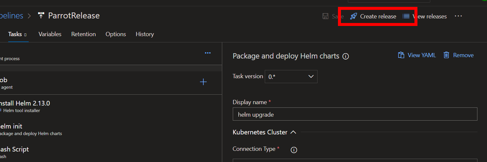

Tabla de Contenidos
- [Introducción](#introducci%C3%B3n)
  - [Prerrequisitos](#prerrequisitos)
  - [Conocimientos básicos de Kubernetes](#conocimientos-b%C3%A1sicos-de-kubernetes)
  - [Vistazo general de la aplicación](#vistazo-general-de-la-aplicaci%C3%B3n)
- [Ejercicio 1: Creando un servicio de Azure Kubernetes Services y Azure Container Registry](#ejercicio-1-creando-un-servicio-de-azure-kubernetes-services-y-azure-container-registry)
  - [Creación de un Container Registry](#creaci%C3%B3n-de-un-container-registry)
  - [Creación de un Azure Kubernetes Services](#creaci%C3%B3n-de-un-azure-kubernetes-services)
  - [Roles y permisos para ACR](#roles-y-permisos-para-acr)
- [Ejercicio 2: Importando el código](#ejercicio-2-importando-el-c%C3%B3digo)
- [Ejercicio 3: Creando el Build Pipeline](#ejercicio-3-creando-el-build-pipeline)
- [Ejercicio 4: Creando el Release Pipeline](#ejercicio-4-creando-el-release-pipeline)

# Introducción

 
En este laboratorio se realizará las tareas necesarias para efectuar un deployment de una aplicación de contenedores en Kubernetes en un ambiente de Azure Kubernetes Services (AKS). 

Alguna de las cosas que se verán en este laboratorio serán:

- Deployment de Kubernetes
- Deploy de una aplicación mediante Helm
- Construyendo un pipeline de CI/CD utilizando Azure DevOps y Azure Container Registry

> Este laboratorio se basa en las instrucciones indicadas en el artículo [https://cloudblogs.microsoft.com/opensource/2018/11/27/tutorial-azure-devops-setup-cicd-pipeline-kubernetes-docker-helm/](https://cloudblogs.microsoft.com/opensource/2018/11/27/tutorial-azure-devops-setup-cicd-pipeline-kubernetes-docker-helm/). Sin embargo, introduce mejoras al proceso señalado en dicho artículo.

## Prerrequisitos
- Subscripción de Azure. Sí no posee una, obtenga un trial: [https://azure.microsoft.com/es-es/free/](https://azure.microsoft.com/es-es/free/)
- Cuenta de Azure DevOps, puede obtener una en [https://dev.azure.com](https://dev.azure.com)
- Para la ejecución de comandos puede utilizar el Azure Cloud Shell disponible en [https://shell.azure.com/](https://shell.azure.com/) una vez que inicie sesión con su subscripción de Azure. El Azure Cloud Shell tiene preinstalado y configurado el Azure CLI para conectarse a su subscripción de Azure así como también **kubectl** y **helm**.

## Conocimientos básicos de Kubernetes
Para este laboratorio se asume que se tiene conocimientos básicos sobre Kubernetes y sus conceptos generales.

Si es nuevo en Kubernetes, puede empezar con [Kubernetes Learning Path](https://aka.ms/LearnKubernetes "Kubernetes Learning Path") y luego avanzar con los conceptos sobre [qué es y qué no es Kubernetes.](https://aka.ms/k8sLearning "qué es y qué no es Kubernetes.") Si ya tiene mas experiencia como desarrollador o administrador de Kubernetes, puede revisar la [guía de mejores prácticas en Kubernetes](https://aka.ms/aks/bestpractices "guía de mejores prácticas en Kubernetes").

## Vistazo general de la aplicación
Se efectuará el deployment de la aplicación **Phippy and Friends**, la cual se encuentra en el repo: [https://github.com/Azure/phippyandfriends](https://github.com/Azure/phippyandfriends). Dicho repositorio tiene unos servicios, cada uno representa un personaje individual en la "Guía para Niños sobre Kubernetes y su nuevo amigo NodeBrady". Cada servicio esta construido en lenguaje de programación diferente, con lo cual se quiere mostrar como un clúster de AKS puede ejecutar cualquier tipo de aplicación. **Parrot** está en .NET Core, **CaptainKube** en GO, **Phippy** en PHP y **NodeBrady**  en Node.js.

# Ejercicio 1: Creando un servicio de Azure Kubernetes Services y Azure Container Registry

Durante este ejercicio haremos uso la Azure Cloud Shell, la cual se encuentra disponible en [https://shell.azure.com/](https://shell.azure.com/).

El siguiente comando crea un grupo de recurso  `$rg` en una ubicación específica `$location` (por ejemplo **eastus**). El cual contendrá nuestros servicios

~~~
$ az group create -l $location -n $rg
~~~

## Creación de un Container Registry

Crea un Azure Container Registry `$acr`

~~~
$ az acr create -n $acr -g $rg -l $location --sku Basic
~~~

## Creación de un Azure Kubernetes Services

El siguiente comando nos permite obtener la ultima versión disponible de AKS.

~~~
$ latestK8sVersion=$(az aks get-versions -l $location --query 'orchestrators[-1].orchestratorVersion' -o tsv)
$ az aks create -l $location -n $name -g $rg --generate-ssh-keys -k $latestK8sVersion
~~~

Una vez creado, el proceso puede tomar aproximadamente 10 min, se deberán obtener las credenciales para interactuar con el clúster de AKS.

~~~
$ az aks get-credentials -n $name -g $rg
~~~

Vamos a configurar tiller para Helm. Tiller correrá dentro nuestro clúster de Kubernetes, y aadministrará la instalaciones de los charts.

~~~
$ kubectl create serviceaccount tiller --namespace kube-system
$ kubectl create clusterrolebinding tiller --clusterrole cluster-admin --serviceaccount=kube-system:tiller
~~~

Finalmente definimos el namespace *phippyandfriends*, al cual posteriormente haremos deploy de nuestras apps.

~~~
$ kubectl create namespace phippyandfriends
$ kubectl create clusterrolebinding default-view --clusterrole=view --serviceaccount=phippyandfriends:default
~~~

## Roles y permisos para ACR

Ejecutaremos los siguientes comandos para permitir que AKS tenga privilegios de *pull* sobre ACR.

~~~
$ CLIENT_ID=$(az aks show -g $rg -n $name --query "servicePrincipalProfile.clientId" -o tsv)
$ ACR_ID=$(az acr show -n $acr -g $rg --query "id" -o tsv)
$ az role assignment create --assignee $CLIENT_ID --role acrpull --scope $ACR_ID
~~~

# Ejercicio 2: Importando el código

1. En su subscripción de Azure DevOps cree un nuevo proyecto.
2. En su propio Azure Repo, del proyecto creado en el paso anterior, importe el contenido de [https://github.com/Azure/phippyandfriends](https://github.com/Azure/phippyandfriends).

3. Una vez importado, podremos ver el código de las cuatro aplicaciones: **CaptainKube, NodeBrady, Parrot** y **Phippy**.

   Cada aplicación tiene su propia carpeta y la misma estructura dentro de ella:

   - **Archivos de la aplicación en sí**, dependiendo del lenguaje de programación: **Parrot** está en .NET Core, **CaptainKube** en GO, **Phippy** en PHP y **NodeBrady**  en Node.js.
   - **Archivo DockerFile** es un script utilizado por Docker, compuesto de varios comandos (instrucciones) y argumentos listados sucesivamente para automáticamente realizar acciones en una imagen base para crear una nueva imagen de Docker al empaquetar la aplicación.
   - **Carpeta charts/*** la cual contiene los archivos definiendo los Charts de Helm de la aplicación. Charts de Helm permiten definir, instalar y actualizar la aplicación en Kubernetes.

# Ejercicio 3: Creando el Build Pipeline

Crearemos el Azure Build Pipeline para la aplicación **Parrot** para que sea capaz de compilar/publicar su imagen de Docker y empaquetar/publicar su chart de Helm.

1. Es necesario crear una *Service Connection* entre Azure DevOps y nuestra suscripción de Azure. Para lo cual hay que navegar a las configuraciones de nuestro proyecto.

2. Dentro de la sección Pipelines, seleccionar *Service Connections*, luego *New service connection*  y finalmente elegir la opción *Azure Resource Manager*.

3. Crearemos un *Service Principal Authentication*, donde definiremos: el nombre de la conexión, la subscripción donde nos conectaremos y finalmente el grupo de recurso en el que se encuentra AKS. Por ejemplo:

4. En Azure DevOps, ingresamos a la opción Files --> Repos y posteriormente en el código navegamos a la carpeta *Parrot*. Finalmente presionamos en el botón *Upload file(s)*.

5. Descargamos el archivo [azure-build-pipeline.yml](/assets/azure-build-pipeline.yml "azure-build-pipeline.yml") y reemplazaremos el existente en la carpeta raíz de *Parrot*. Finalmente presionamos en el botón *Commit*.

> El archivo *azure-build-pipeline.yml* contiene la definición del build el cual será utilizado en los siguientes pasos. Este archivo será el encargado de descargar la imagen base de Docker, inyecta la aplicación *parrot*, luego instala Helm, empaqueta el chart de Helm y finalmente hace deploy del resultado de esa operación al Azure Container Registry (ACS).

6. En nuestro proyecto de Azure DevOps, ingresaremos al menú Pipelines --> Builds. Luego seleccionamos la opción "New pipeline".
7. Construimos el pipeline en base a la siguiente animación:

8. En la sección *Variables* definimos lo siguiente:
   1. **projectName**, con el valor *parrot*
   2. **registryName**, cuyo nombre será el definido en el paso [Creación de un Container Registry](#creaci%C3%B3n-de-un-container-registry)
   3. **serviceConnection**, su valor es el nombre definido en las *Service Connections*.

9. Presionamos en el botón *Save & Queue*. Lo cual iniciaría nuestro proceso de build.

10. Una vez culminado exitosamente el proceso de build, los siguientes comandos ayudarán a verificar el resultado de esta. Nuevamente es necesario ejecutar estos comandos en [https://shell.azure.com/](https://shell.azure.com/).
    1.  Listamos el contenido de nuestro Azure Container Registry, `$acr` contiene dicho valor:
 
        ~~~
        $ az acr repository list -n $acr
        ~~~

    2. Lista todos los Helm Charts del ACR

        ~~~
        $ az acr helm list -n $acr
        ~~~

    3. Muestra los detalles de un Chart Helm específico desde su ACR, reemplazar el valor de `chart-name` por el nombre del Chart a buscar

       ~~~
       $ az acr helm show chart-name -n $acr
       ~~~

# Ejercicio 4: Creando el Release Pipeline

Una vez completado el Build, ahora llego el momento de poder hacer liberación de nuestra aplicación en Azure Kubernetes Services (AKS).

1. En el Portal de Azure, navegamos a nuestro *Azure Container Registry*, dentro de la opción *Settings*, seleccionamos *Access Keys* y habilitamos la opción *Admin User*. Esto nos entregará un usuario y password las cuales usaremos en el futuro.

2. En Azure DevOps navegamos a *Pipelines* --> *Release* y finalmente presionamos en *New Pipeline*.

3. En el panel que aparecerá a la derecha de su pantalla, seleccionamos la opción de *Empty Job*.

4. Construimos el release pipeline en base a la siguiente animación:

5. A continuación deberemos definir las propiedades para los objetos ingresados en el punto anterior. 
   * Helm tool installer 
      - Display name:  `Install Helm`
      - Helm Version Spec: `2.13.0`
      - Check for latest version of Helm: `false`
   * Package and Deploy Helm Charts
      - Display name: `helm init`
      - Connection Type: `Azure Resource Manager`
      - Azure Subscripcion: Se debera seleccionar el nombre de la conexión creada en el punto 3 del Ejercicio 3
      - Resource Group: Se indicará el grupo de recurso donde tenemos nuestro cluster de AKS
      - Kubernetes Cluster: Se seleccionará el AKS donde se hará el deployment
      - Namespace: `phippyandfriends`
      - Command: `init`
      - Upgrade Tiller: `true`
      - Arguments: `--service-account tiller --force-upgrade`
    * Bash
      - Display Name: `helm repo add`
      - Type: `Inline`
      - Script: 
         ~~~
         helm repo add $(registryName) https://$(registryName).azurecr.io/helm/v1/repo --username $(registryLogin) --password $(registryPassword)
         ~~~
   * Package and Deploy Helm Charts
      - Display name: `helm upgrade`
      - Azure Subscripcion: Se debera seleccionar el nombre de la conexión creada en el punto 3 del Ejercicio 3
      - Resource Group: Se indicará el grupo de recurso donde tenemos nuestro cluster de AKS
      - Kubernetes Cluster: Se seleccionará el AKS donde se hará el deployment
      - Namespace: `phippyandfriends`
      - Command: `upgrade`
      - Chart Type: `Name`
      - Chart Name: `$(registryName)/$(projectName)`
      - Release name: `$(projectName)`      
      - Install if release not present: `true`
      - Wait: `true`
      - Arguments:            
         ~~~   
         --version $(build.buildId) --set image.repository=$(registryName).azurecr.io/$(projectName) --set image.tag=$(build.buildId) --set ingress.enabled=false
         ~~~

6. Navegamos a la opción *Variables* y definimos los siguientes parámetros:
   * projectName: `parrot`
   * registryName: el nombre de nuestro ACR.
   * registryLogin: Ingresamos el usuario obtenido en el punto 1 de este ejercicio.
   * registryPassword: Ingresamos el password obtenido en el punto 1 de este ejercicio.

7. Finalmente, guardamos nuestro Release mediante el boton `Save` y finalmente hacemos una nueva liberación mediante el botón `Create Release`

8. Una vez culminado exitósamente el release pipeline, nuevamente ingresamos a [https://shell.azure.com/](https://shell.azure.com/) y ejecutaremos el comando:

~~~
kubectl get all -n phippyandfriends
~~~

9. Para ingresar al dashboard de Kubernetes, es necesario ejecutar los siguientes comandos en [https://shell.azure.com/](https://shell.azure.com/). Donde `$rg` es el nombre del grupo de recurso que contiene el AKS y `$name` es el cluster de AKS.

~~~
kubectl create clusterrolebinding kubernetes-dashboard --clusterrole=cluster-admin --serviceaccount=kube-system:kubernetes-dashboard
az aks browse --resource-group $rg --name $name
~~~

Felicitaciones! Ha concluído este laboratorio.

